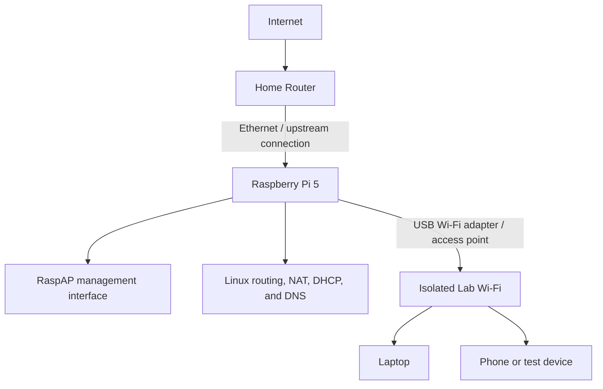

# Raspberry Pi 5 RaspAP Router Home Lab

## Overview

For this project, I built a small home-lab router using a Raspberry Pi 5, RaspAP, and a USB Wi-Fi adapter. I used Ethernet to give the Raspberry Pi an upstream internet connection, then used the USB Wi-Fi adapter to broadcast a seperate wireless network for my lab devices.

I wanted to move beyond using a normal consumer router as a black box and get some hands-on experiance with the services that make routing work. This included wireless access-point configuration, DHCP, DNS, IP forwarding, NAT, firewall behavior, Linux service management, and network troubleshooting.

The finished router gives me a flexible foundation for future networking and cybersecurity projects, including traffic analysis, VPN routing, DNS monitoring, and automated threat alerts.

> This repository is the high-level project overview. The detailed installation, configuration, and troubleshooting procedure is maintained separately in the [RaspAP Walkthrough](https://github.com/Kin3o/RaspAP-Walkthrough).

## Lab Objectives

- Configure my Raspberry Pi 5 as a functional Linux-based router.
- Use Ethernet as my WAN/upstream internet connection.
- Use an AP-capable USB Wi-Fi adapter to broadcast my lab network.
- Manage the hotspot, DHCP, and DNS settings through RaspAP.
- Learn how `hostapd`, `dnsmasq`, IP forwarding, and NAT work together.
- Secure my wireless network with a custom SSID and modern encryption.
- Enable SSH so I could manage and troubleshoot the Pi remotely.
- Confirm that my client devices received valid network settings and could reach the internet.
- Build a platform I can reuse for future networking and cybersecurity experiments.

## Network Architecture

In my build, Ethernet appeared as `eth0` and provided the upstream connection. The USB Wi-Fi adapter appeared as `wlan1` and broadcast the hotspot, while `wlan0` was the Raspberry Pi's built-in wireless interface. I still had to verify the interface names because they can be diffrent between systems.

## How It Works

1. I connected the Raspberry Pi to my home router over Ethernet for internet access.
2. I used the RaspAP web interface to manage the hotspot and related network services.
3. My USB Wi-Fi adapter operated in Access Point mode and broadcast the lab SSID.
4. `hostapd` controlled the access point, authentication, channel, and encryption settings.
5. `dnsmasq` assigned IP addresses and provided DHCP and DNS services to my clients.
6. Linux IP forwarding and NAT routed my lab traffic out through the upstream network.
7. My connected devices used the Raspberry Pi as their default gateway while staying on a seperate lab subnet.

## Hardware

| Component | Purpose |
| --- | --- |
| Raspberry Pi 5 and power supply | Runs Raspberry Pi OS, RaspAP, and the routing services |
| MicroSD card and card reader | Stores the operating system and router configuration |
| AP-capable USB Wi-Fi adapter | Broadcasts the wireless lab network |
| Ethernet cable | Connects the Raspberry Pi to the upstream router |
| Windows 11 computer | Images the MicroSD card, manages the router, and tests connectivity |
| Phone or other wireless device | Acts as an additional client for validation |

The USB Wi-Fi adapter was one of the most important parts of my setup because it needed to support Access Point mode. I found that adapter compatibility, Linux driver support, and available wireless modes could directly affect hotspot reliability and performance.

## Software and Services

| Tool or service | Role in the lab |
| --- | --- |
| Raspberry Pi OS / Linux | Base operating system and networking environment |
| RaspAP | Web interface for hotspot and router management |
| Raspberry Pi Imager | Writes the operating-system image and applies initial settings |
| `hostapd` | Creates and secures the wireless access point |
| `dnsmasq` | Supplies DHCP leases and DNS services to clients |
| Linux IP forwarding | Passes packets between the client and upstream interfaces |
| NAT / iptables | Translates and forwards lab-client traffic to the internet |
| SSH | Provides remote administration and log access |
| PowerShell / Windows networking tools | Verifies client addressing, gateway, DNS, and connectivity |

## Implementation Summary

I installed a 64-bit RaspAP image, connected the Pi to my home network through Ethernet, and enabled SSH in case I lost access to the web interface. After checking my network interfaces, I assigned the USB adapter to the hotspot and configured my SSID, country, wireless mode, client limit, and WPA2/WPA3 security. RaspAP gave me a simple way to manage everything while the Linux services handled DHCP, DNS, routing, and NAT in the background.

## Security Considerations

- I changed the default RaspAP and wireless credentials immediately.
- WPA2 or WPA3 with AES/CCMP should be used when supported by the adapter and clients.
- SSH should use a strong unique password or, preferably, key-based authentication.
- The hotspot should use a separate, non-overlapping subnet from the home network.
- Client access should be limited to the devices required for the lab.
- Firewall policy and management-interface exposure should be reviewed before using the router outside a controlled environment.
- The router and installed packages should be kept updated.

## Skills Demonstrated

- Raspberry Pi and Linux administration
- Wireless access-point configuration
- Network-interface identification and management
- DHCP and DNS configuration
- IPv4 forwarding, NAT, and firewall fundamentals
- SSH-based remote administration
- Linux service and log analysis
- Layered network troubleshooting
- Connectivity and post-reboot validation
- Technical documentation of a repeatable home-lab project

## Future Enhancements

- Add explicit firewall and network-segmentation policies.
- Route selected clients through WireGuard or OpenVPN.
- Add network-wide DNS filtering and ad blocking.
- Capture and analyze traffic with tools such as tcpdump or Wireshark.
- Add centralized traffic, DHCP, DNS, and system logging.
- Build dashboards for bandwidth, availability, and client activity.
- Detect port scans, unusual DNS behavior, and other suspicious traffic.
- Send automated email alerts for high-risk events.
- Explore an AI-assisted monitoring agent that summarizes activity and helps prioritize investigations.

## Project Outcome

By the end of this lab, I had a working wireless router that I could manage myself and a practical way to learn how Linux networking components work together. More importantly, I now have an expandable platform for future defensive-security, monitoring, VPN, firewall, and traffic-analysis projects without putting experimental services directly on my main home network.

## Related Repository

- [RaspAP Walkthrough](https://github.com/Kin3o/RaspAP-Walkthrough) — detailed installation, configuration, testing, and troubleshooting guide
